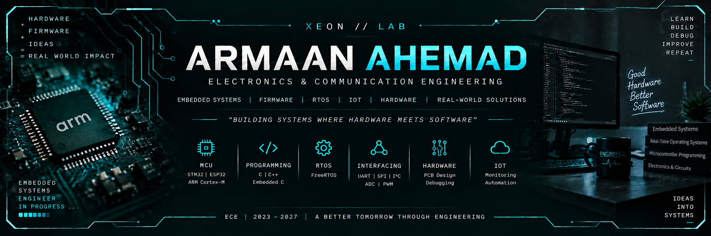

# ARMAAN AHEMAD

> **Embedded Systems • Firmware • RTOS • IoT**

<p align="center">
  
</p>

<p align="center">
  <b>B.Tech Electronics & Communication Engineering · 2023–2027</b>
</p>

<p align="center">
  <a href="https://github.com/XeonRepo">
    
  </a>
  
  
  
</p>

---

## 🧑‍💻 Embedded Systems Engineer in Progress

I'm a final-year **B.Tech Electronics & Communication Engineering** student focused on building reliable embedded systems across hardware, firmware and real-time software layers.

My primary interests include **Embedded C, ARM Cortex-M, RTOS, firmware architecture, peripheral interfacing, debugging, bootloaders and IoT systems**.

I enjoy understanding systems at the low level — from microcontroller peripherals and interrupts to task scheduling, context switching, communication protocols and firmware recovery.

> **"Hardware gives the system a body. Firmware gives it a brain."**

---

# 🧭 Engineering Profile

| Category | Details |
|---|---|
| 🎓 **Education** | B.Tech — Electronics & Communication Engineering · 2023–2027 |
| ⚙️ **Primary Focus** | Embedded Systems · Firmware Engineering · Real-Time Systems · IoT |
| 🧠 **Current Direction** | ARM Cortex-M · RTOS Internals · Embedded C · Low-Level Firmware |
| 🔧 **Microcontrollers** | STM32 · ESP32 · ESP8266 · Arduino · AVR · PIC |
| 🔌 **Interfaces** | UART · SPI · I²C · GPIO · ADC · PWM |
| ⏱️ **RTOS Concepts** | Task Scheduling · Queues · Semaphores · Mutex · Context Switching |
| 🛠️ **Engineering Tools** | Git · GitHub · VS Code · Proteus · Altium Designer · MPLAB X IDE |
| 🐞 **Debugging** | GDB · QEMU · Logic Analyzer · Oscilloscope · Serial Monitor |
| 🐧 **Operating Systems** | Linux (Fedora) · Windows |

---

# ⚡ Technical Arsenal

### 💻 Programming
`C` · `Embedded C` · `C++` · `Python`

### 🧩 Microcontrollers & Platforms
`ARM Cortex-M` · `STM32` · `ESP32` · `ESP8266` · `Arduino` · `AVR` · `PIC`

### ⏱️ RTOS & Firmware
`FreeRTOS` · `Task Scheduling` · `Queues` · `Semaphores` · `Mutex` · `Context Switching`

### 🔗 Hardware Interfaces
`UART` · `SPI` · `I²C` · `GPIO` · `ADC` · `PWM`

### 🐞 Debugging & Validation
`GDB` · `QEMU` · `Logic Analyzer` · `Oscilloscope` · `Serial Monitor`

### 🧰 Development Tools
`Git` · `GitHub` · `VS Code` · `Arduino IDE` · `Proteus` · `Altium Designer` · `MPLAB X IDE`

---

# 🚀 Featured Engineering Projects

## 🛡️ Phoenix OS
### *Self-Healing Real-Time Kernel for Embedded Systems*

**ARM Cortex-M • QEMU • Custom RTOS • PendSV • Bootloader • GDB**

Phoenix OS is a low-level embedded systems project exploring how firmware can detect, isolate and recover from runtime failures without relying on an existing RTOS.

The project combines **custom RTOS development, context switching, scheduling, synchronization, bootloader design and firmware recovery** into one experimental embedded architecture.

```text
                         APPLICATION
                              │
                              ▼
                  ┌───────────────────────┐
                  │      CUSTOM RTOS      │
                  │ Scheduler / IPC       │
                  │ Semaphores / Mutex    │
                  └───────────┬───────────┘
                              │
                              ▼
                  ┌───────────────────────┐
                  │    ARM CORTEX-M       │
                  │ Interrupts / PendSV   │
                  │ Context Switching     │
                  │ Fault Handling        │
                  └───────────┬───────────┘
                              │
                              ▼
                  ┌───────────────────────┐
                  │    BOOT & RECOVERY    │
                  │ Checksum Validation   │
                  │ Dual-Bank Firmware    │
                  │ Rollback / Recovery   │
                  └───────────────────────┘
```

### 🔬 Engineering Work
- Designed a **custom preemptive priority-based RTOS kernel**.
- Implemented task scheduling and **PendSV-based context switching**.
- Developed synchronization mechanisms using **semaphores and mutexes**.
- Explored lightweight **inter-process communication** mechanisms.
- Designed a dual-bank bootloader with **checksum validation**.
- Implemented firmware rollback and recovery concepts.
- Used **QEMU** for embedded execution and testing.
- Used **GDB** for debugging, fault injection and recovery validation.

### 🎯 Project Objective
To explore how embedded firmware can be designed with **fault detection, controlled recovery and improved system reliability** at the firmware level.

---

## 🌡️ Smart Environmental Monitoring System

**STM32 / ESP32 • FreeRTOS • Embedded C • UART • I²C • ADC**

A multitasking environmental monitoring system developed using **FreeRTOS**, with independent tasks responsible for sensor acquisition, display and serial communication.

```text
              ┌──────────────────────────┐
              │ Temperature & Humidity    │
              │         Sensors           │
              └────────────┬─────────────┘
                           │ I²C
                           ▼
              ┌──────────────────────────┐
              │       SENSOR TASK        │
              │      Data Acquisition    │
              └────────────┬─────────────┘
                           │
                      Queue / IPC
                           │
                 ┌─────────┴─────────┐
                 ▼                   ▼
       ┌─────────────────┐   ┌─────────────────┐
       │    LCD TASK     │   │ COMMUNICATION   │
       │  Real-Time Data │   │      TASK       │
       └─────────────────┘   │      UART       │
                             └─────────────────┘
```

### 🔬 Engineering Work
- Developed multiple concurrent tasks using **FreeRTOS**.
- Interfaced environmental sensors using **I²C**.
- Implemented real-time sensor data acquisition.
- Displayed sensor readings on an LCD.
- Implemented serial communication using **UART**.
- Used queues and synchronization concepts for inter-task communication.
- Worked with task priorities and execution timing.

### 🎯 Project Objective
To understand how an embedded application can be divided into independent real-time tasks while maintaining reliable communication and synchronization between them.

---

## ⚡ IoT-Based Three-Phase Power Failure Monitoring

**Arduino Uno • ESP32 • SIM800A • ZMPT101B • ThingSpeak • Embedded C**

An IoT-enabled electrical monitoring system designed to detect **three-phase power failures and abnormal voltage conditions** while providing remote alerts and monitoring.

```text
                    3-PHASE POWER
                          │
                          ▼
                ┌──────────────────┐
                │    ZMPT101B      │
                │ Voltage Sensors  │
                └────────┬─────────┘
                         │
                         ▼
                ┌──────────────────┐
                │ Arduino / ESP32  │
                │ Fault Detection  │
                └────────┬─────────┘
                         │
                  ┌──────┴──────┐
                  ▼             ▼
                Wi-Fi           GSM
                  │             │
                  ▼             ▼
             ThingSpeak      SMS Alert
```

### 🔬 Engineering Work
- Monitored three-phase voltage conditions.
- Implemented phase-failure and undervoltage detection.
- Integrated **ESP32 Wi-Fi connectivity**.
- Used **ThingSpeak** for remote monitoring and data logging.
- Integrated **SIM800A GSM** for SMS-based fault alerts.
- Implemented voltage measurement and logging.
- Added watchdog-based recovery mechanisms.
- Achieved approximately **98% fault-detection accuracy across 50+ test cycles**.

### 🎯 Project Objective
To develop a practical monitoring system capable of detecting electrical faults and communicating important system conditions remotely.

🔗 **Project Repository:** https://github.com/XeonRepo/IoT-Power-Failure-Monitoring

---

# 🏭 Industrial Exposure

## Banaras Locomotive Works — Varanasi

**6-Week Summer Internship · June 2026 – July 2026**

During my industrial internship at **Banaras Locomotive Works**, I gained practical exposure to industrial electronic and control systems used in a large-scale locomotive manufacturing environment.

### Areas of Exposure
- **SCADA & Industrial Automation**
- **Process Control Systems**
- **Locomotive Testing**
- **Traction Control Systems**
- **Industrial Communication Networks**
- **Electrical & Electronic Control Systems**

The internship helped connect academic concepts with **real-world industrial automation, monitoring, control and testing environments**.

---

# 🧠 Engineering Mindset

I believe good embedded engineering requires understanding the **complete system**, not just writing application code.

```text
        HARDWARE
            │
            ▼
       PERIPHERALS
            │
            ▼
        DRIVERS
            │
            ▼
        FIRMWARE
            │
            ▼
     RTOS / SCHEDULING
            │
            ▼
      APPLICATION
            │
            ▼
   DEBUGGING & TESTING
            │
            ▼
     RELIABLE SYSTEM
```

My learning approach is centered around:

**Understand → Build → Test → Debug → Improve**

---

# 🔭 Currently Exploring

```text
ARM Cortex-M Internals
          │
          ▼
Custom RTOS Development
          │
          ▼
Context Switching & Scheduling
          │
          ▼
Bootloader Development
          │
          ▼
Firmware Recovery
          │
          ▼
Embedded Debugging
          │
          ▼
Reliable Embedded Systems
```

Currently deepening my understanding of:
- ARM Cortex-M architecture
- Interrupts and exception handling
- RTOS internals
- Task scheduling
- Context switching
- Bootloaders
- Firmware recovery
- Embedded debugging
- Reliable firmware architecture

---

# 🛠️ What I Like Building

| 🔌 Embedded Systems | ⏱️ Real-Time Systems | 🌐 IoT Systems | 🔧 Hardware |
|---|---|---|---|
| MCU Firmware | RTOS Tasks | Sensor Networks | PCB Design |
| Device Drivers | Scheduling | Remote Monitoring | Peripheral Interfacing |
| Embedded C | IPC | Cloud Connectivity | Hardware Debugging |
| Low-Level Systems | Synchronization | Industrial IoT | Electronics Prototyping |

---

# 📚 Certifications

- **Embedded System Developer** — Microchip Technology / Coherent 15 / Eduskill
- **PCB Basic Design Certification** — Altium Education
- **C Programming with Arduino** — Sofcon India Pvt. Ltd. / NSDC Skill India
- **Generative AI Mastermind** — Growth School / Outskill

---

# 📂 What You'll Find on My GitHub

I use GitHub not only to store projects, but also as an engineering workspace for documenting my learning, experiments and implementations.

### Areas I'm Building Around

```text
Embedded C
   ├── Microcontroller Programming
   ├── Peripheral Interfacing
   └── Firmware Experiments

RTOS
   ├── Task Scheduling
   ├── Synchronization
   ├── IPC
   └── Context Switching

ARM Cortex-M
   ├── Low-Level Programming
   ├── Interrupts
   ├── Debugging
   └── RTOS Development

IoT
   ├── Sensors
   ├── Communication
   ├── Remote Monitoring
   └── Industrial Applications
```

---

# 📊 GitHub

My repositories are a record of my progression from **electronics fundamentals to low-level firmware and real-time embedded systems**.

I'm continuously adding projects, experiments and technical implementations as I learn.

<p align="center">
  <a href="https://github.com/XeonRepo?tab=repositories">
    
  </a>
</p>

---

# 🤝 Let's Connect

I'm interested in connecting with people working or learning in:

**Embedded Systems • Firmware • Electronics • RTOS • ARM • IoT • Industrial Automation**

<p align="center">

📧 **Email:** armaanahemad@outlook.com

💼 **LinkedIn:** https://linkedin.com/in/armaan-ahemad

💻 **GitHub:** https://github.com/XeonRepo

</p>

---

<p align="center">

## ⚡ BUILD. DEBUG. LEARN. REPEAT.

<i>Exploring the intersection of electronics, firmware and real-time systems.</i>

</p>
